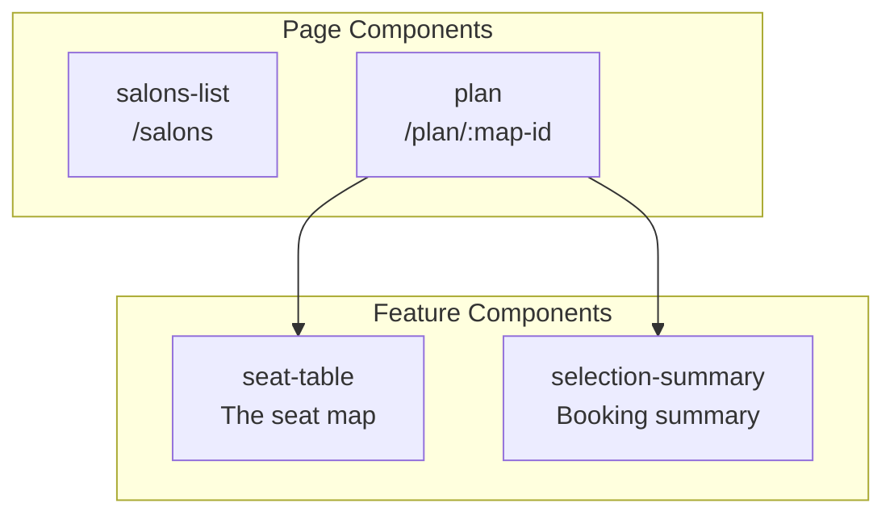
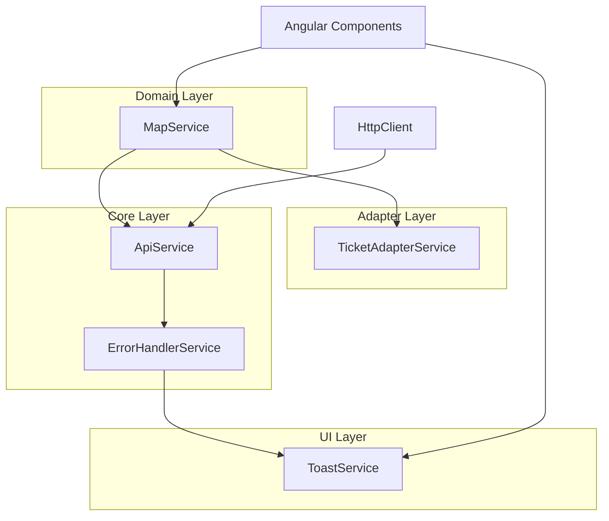
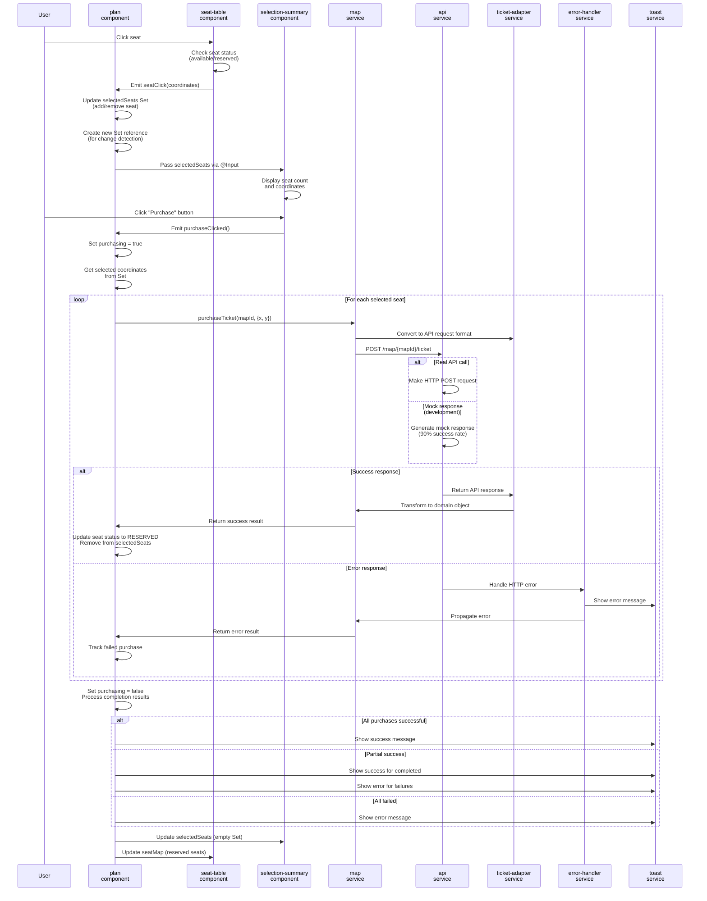

# Documentation
> MAKE SURE MERMAID VS CODE EXTENTAION IS INSTALLED AND ENABLED.

## توضیحات غیر تکنیکال!

خب توی این چلنج من تلاش کردم پروژه رو به عنوان اولین تجربه انگولار پیاده کنم.

روند کار به این صورت بود که من داکیومنت انگولار رو یه نگاهی انداختم، خب طبیعتا پیچیده بود، پروژه رو باز کردم و تلاش کردم یه ساختار کلی براش پیاده کنم ولی آشنا نبودن با انگولار یا دقیق تر بگم بخاطر نداشتن ذهنی که انگولاری فکر کنه نمی تونستم ساختار درستی بدست بیارم
در این حد بگم که اومدم نوشتم Signal بعد دیدم ساپورت نمیشه، بعد package.json رو باز کردم دیدم انگولار ۱۳ عه! بعد با یه دست زدم تو سر خودم و رفتم داک انگولار ورژن ۱۳ رو باز کردم، اون موقع دو دستی زدم تو سر خودم! 😬

اینجا خیلی نا امید شدم چون واقعا نمی تونستم پروژه پیش ببرم که دو راه داشتم، یکی اینکه برگردیم به آپشن اول که درخواست بدم یه چلنج ری اکتی بهم داده بشه یا اینکه سعی کنم از پس همین بر بیام
که یه گهی خوردم و راه دوم رو انتخاب کردم. 😁

خلاصه که روند کار به این صورت بود که، من دیدم هرچی میخوام یه چیزی بزنم میفهمم یه چیزی هست که بلد نیستم، دیگه گفتم فایده نداره، یه پرامپ گنده نوشتم واسه کرسر، گفتم توی ۶ کامیت کل پروژه رو بزنه بره
اونم کم نذاشت و یه مشت چرت و پرت واسم تولید کرد ولی بعدش یه چارچوبی داشتم که روش کار کنم، خلاصه که ۶ کامیت اول رو کرسر زد و من فقط واسش دست می زدم، البته اصلا کامل نبود! کامیت های بعدی هم داشتم در اقیانوس انگولار دست و پا می زدم تا اینکه کم کم یه نظمی گرفت و به سمتی که می خواستم رفت و با ۲۴ کامیت دیگه رسید به حالت الان.

خلاصه که این تصمیمی که گرفتم گیت فلو رو نا منظم کرده، و من چون نمی تونستم از پایه پروژه رو دیزاین کنم مجبور شدم تیکه تیکه بهبودش بدم تا به خروجی مطلوب برسیم.
اگر کامیت هارو هم نگاه کنید میبینید که یه چیزی پیاده شده، بعد چند بار عوض شده و یا اصلا کلا جایگزین شده.

**چه کارهایی کردم:**

مواردی که توی فایل READM.me گفته شده بود مثل بحث پرفورمنس جدول یا ریسپانسیو بودن رو رعایت کردم.

سعی کردم چیز هایی که به طور کلی از فرانت اند بلد بودم رو در پروژه استفاده کنم، چون انگولاری فکر کردم واسم دشوار بود و نیاز به تجربه داره. مثلا generate کردن تایپ api ها از روی فایل های مثال swagger و اسفاده از Adapter برای تبدیل تایپ ها و دیتا ها

**چه کار هایی نکردم و اگر الان بخوام از اول پروژه رو بزنم انجام میدم:**

الان که یه ۴۸ ساعت با انگولار ور رفتم خیلی مسیر ها واسم روشن تره، میتونم بفهمم چیا رو میتونستم بهتر دیزاین کنم، این دیدی بود که در ابتدا اصلا نداشتم.

با کرسر شروع نمی کردم! این روشی که کرسر یه ساختار داغون بده که روش کار کنم و هم زمان انگولار یاد بگیرم اگر چه به نظرم تنها راه بود ولی خیلی منو درگیر دوباره کاری کرد، چون کرسر به ساز خودش خیلی چرت و پرت تولید کرد که پاک کردن و جایگزین کردنش اصلا کار ساده نبود و فوق العاده وقت گیر و گیج کننده بود.

تست می نوشتم! حقیقتش تلاش هم کردم توی کامیت ها تست هارو داشته باشم، ولی خب تست ها خیلی ai-generated و نمایشی شده بود، بیاین قبول کنیم برای نوشتن تستی که واقعا باگ هارو گیر بندازه هم نیاز به دانش  هست که من حتی karma هم برام ناشناخته س.     در نتیجه ترجیح دادم تست هارو پاک کنم تا اینکه تست های نمایشی داشته باشم. 

## UI Components Architecture

The application consists of 2 main pages with a hierarchical component structure:

### Component Hierarchy Diagram

### Component Responsibilities

**salons-list**

- Displays available salons
- Handles navigation to seat selection

**plan**

- Container for seat selection workflow
- Manages state between child components

**seat-table**

- Renders interactive seat map
- Handles seat selection/deselection

**selection-summary**

- Shows selected seats summary
- Handles final booking confirmation

## Architecture Overview

The services are organized in a layered architecture with clear separation of concerns:

- **Core Layer**: Base infrastructure services
- **Adapter Layer**: Data transformation between API and domain models
- **Domain Layer**: Business logic services
- **UI Layer**: User interface services

راستشو بخواید این چیزی بود که خیلی در سر داشتم انجام بشه، تا حدود خوبی هم به سمتش رفتم ولی خب اگر پروژه از ابتدا دیزاین میشد خیلی بهتر میبود تو این زمینه.

## Service Descriptions

### Core Services

**ApiService** - Generic HTTP client with caching, error handling, and mock support

- Handles GET/POST requests with type safety
- Built-in response caching (configurable duration)
- Automatic error handling via ErrorHandlerService
- Mock response support for development

**ErrorHandlerService** - Centralized error management

- Translates HTTP errors to Persian user messages
- Integrates with ToastService for notifications
- Handles both network and application errors

### Adapter Services

**TicketAdapterService** - Data transformation layer

- Converts API responses to domain objects
- Isolates domain logic from API structure changes
- Handles seat map and ticket purchase transformations

### Domain Services

**MapService** - Stadium and ticket management

- Fetches available stadium maps
- Loads seat layouts with caching
- Processes ticket purchases
- Includes realistic mock data generation

### UI Services

**ToastService** - User notification system

- Success/error message display
- Auto-dismiss with configurable duration
- Observable-based state management

## Service Dependencies

## Fetures To mention

### Performance Optimizations

**Virtual Scrolling**

- `seat-table` component implements Angular CDK virtual scrolling for large seat maps (up to 10,000+ seats).
- _File: `src/app/plan/seat-table/seat-table.component.html`_

**OnPush Change Detection**

- All components use `ChangeDetectionStrategy.OnPush` to minimize change detection cycles.

**Event Delegation**

- `seat-table` uses single click listener on parent container instead of individual listeners per seat. Significantly reduces memory usage for large seat grids.
- _File: `src/app/plan/seat-table/seat-table.component.ts`_

**TrackBy Functions**

- Optimized `*ngFor` loops with trackBy functions prevent unnecessary DOM re-renders during data updates.
- _File: `src/app/plan/seat-table/seat-table.component.ts`_

### User Experience Features

**Keyboard Navigation**

- Full keyboard accessibility with Enter/Space key support for seat selection. ARIA labels and proper focus management.
- _Files: `src/app/plan/seat-table/seat-table`_

### State Management

**Immutable Updates**

- Selected seats tracked with Set data structure. Creates new Set references for proper change detection propagation to child components.
- _File: `src/app/plan/plan.component.ts`_

**Reactive State**

- RxJS observables with proper cleanup using `takeUntil` pattern. Prevents memory leaks on component destruction.
- _File: `src/app/plan/plan.component.ts`_

**Batch Purchase Processing**

- Handles multiple seat purchases concurrently with progress tracking and partial failure recovery.
- _File: `src/app/plan/plan.component.ts`_

### Architecture Patterns

**Smart/Dumb Components** - Clear separation between container (`plan`) and presentation components (`seat-table`, `selection-summary`).

## Service Features

### HTTP & API Management

**Generic API Service**

- Type-safe HTTP client with configurable caching, mock responses, and automatic error handling. Supports both GET/POST with proper TypeScript generics.
- _File: `src/app/services/core/api.service.ts`_

**Response Caching**

- Configurable cache duration per endpoint (default 5min). Automatic cache invalidation and manual cache clearing capabilities.
- _File: `src/app/services/core/api.service.ts`_

### Data Layer Architecture

**Adapter Pattern**

- Clean separation between API contracts and domain models. Transforms external API responses into internal application types.
- _File: `src/app/services/adapters/ticket-adapter.service.ts`_

**Generated API Types**

- TypeScript interfaces generated from Swagger/OpenAPI specs. Ensures type safety between frontend and backend contracts.
- _Files: `src/app/generated/ticket-purchase-api.ts`, `src/app/generated/seat-map-api.ts`, `src/app/generated/map-ids-api.ts`_

اینجا تصور کردیم بک اند دولوپر های مهربون بهمون سوعگر دادن

**Domain Model Isolation**

- Internal models (`AppSeatMap`, `AppTicketPurchase`) isolated from API changes. Business logic protected from external API modifications.
- _File: `src/app/models/index.ts`_

### Error Handling Strategy

**Centralized Error Management**

- Single service handles all error types (HTTP, network, application). Consistent error reporting across the application.
- _File: `src/app/services/core/error-handler.service.ts`_

## Ticket Purchase Flow

The following diagram shows the complete data flow when a user purchases tickets, from seat selection to final confirmation:

